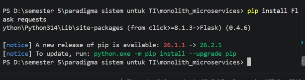

## LAPORAN [Arsitektur Monolith vs Microservices]

### Disusun Oleh:  
Nama               : [Riatunnisa]  
NIM                : [2024903430051]  
Kelas              : [TRKJ 3D]

### Program Studi Teknologi Rekayasa Komputer Jaringan
### Jurusan Teknologi Informasi dan Komputer
### Politeknik Negeri Lhokseumawe
### 2026

---

## Lembar Pengesahan

| No. Praktikum     | : | [01] |
|------------------:|:-:|:--------------|
| Judul Praktikum   | : | [Arsitektur monolith vs microservices] |
| Tanggal Praktikum | : | [22 September 2026] |
| Tanggal Penyerahan| : | [6 Oktober 2026] |
| Nama Praktikan    | : | [Riatunnisa] |
| NIM/Kelas Praktikan| : | [2024903430051] / [TRKJ 3D] |
| Nilai Praktikum   | : | .......................... |
| Dosen Pengampu    | : | M.Reza Zulman,SST., M.Sc	 |

Mengetahui,  
Dosen Pengampu
     

M.Reza Zulman,SST., M.Sc	.

## Daftar Isi
- [Lembar Pengesahan](#lembar-pengesahan)
- [Daftar Isi](#daftar-isi)
- [Tujuan Praktikum](#tujuan-praktikum)
- [Dasar Teori](#dasar-teori)
- [Alat dan Bahan](#alat-dan-bahan)
- [Langkah Kerja](#langkah-kerja)
- [Hasil dan Pembahasan](#hasil-dan-pembahasan)
- [Kesimpulan](#kesimpulan)
- [Referensi](#referensi)
---

## A. Langkah Kerja

1. Persiapan dan Instalasi Library
Sebelum membuat aplikasi, dilakukan instalasi library Flask dan Requests. Flask digunakan untuk membuat aplikasi web menggunakan Python, sedangkan Requests digunakan untuk melakukan komunikasi HTTP antar-service.

Buka VS Code, kemudian pilih:

Terminal → New Terminal

Pada terminal, jalankan perintah:
s
pip install Flask requests

Tekan Enter dan tunggu sampai proses instalasi selesai. Perintah instalasi ini sesuai dengan modul praktikum.

2. Membuat Aplikasi Monolith

Pada tahap ini dibuat aplikasi Monolith, yaitu aplikasi yang menggabungkan fitur Buku dan Pesanan dalam satu aplikasi.
Langkah-langkah:
1. Buka VS Code.
-Buka VS Code.  
2. Buat atau buka folder praktikum. 
3. Pada bagian Explorer, klik New File. 
Beri nama: 
4. monolith_app.py
5. Masukkan kode aplikasi Monolith yang telah disiapkan. 
 
 
Aplikasi memiliki data buku dan pesanan yang disimpan menggunakan in-memory database. Fitur buku dapat diakses melalui /books, sedangkan fitur pesanan menggunakan /orders.

6.	Simpan file dengan menekan: 
Ctrl + S

3. Menjalankan Aplikasi Monolith
Setelah file disimpan, buka terminal pada folder project.

Jalankan:
python monolith_app.py
Kemudian tekan Enter.
Aplikasi akan dijalankan menggunakan Flask. Pada file yang kamu kirim, aplikasi Monolith menggunakan alamat host 127.0.0.1 dan port 5001. 
 
4. Pengujian Fitur Buku pada Monolith
Setelah aplikasi berjalan, buka Google Chrome.
Pada address bar ketik:
http://localhost:5001/books
Kemudian tekan Enter.
Sistem akan menampilkan data buku yang tersedia. Data awal yang digunakan adalah:
 
Data tersebut berasal dari database sementara yang terdapat pada aplikasi Monolith. 

5. Pengujian Fitur Pesanan pada Monolith
Untuk menguji fitur pesanan, digunakan endpoint:
Pengujian dapat dilakukan menggunakan perintah:
curl -X POST -H "Content-Type: application/json" -d "{\"book_id\": 1}" http://localhost:5001/orders
Tekan Enter.
Jika buku tersedia dan stok masih lebih dari 0, sistem akan mengurangi stok buku sebanyak satu dan membuat pesanan dengan status berhasil. 

6. Membuat Book Service
Setelah pengujian Monolith selesai, aplikasi kemudian dipisahkan menjadi beberapa service menggunakan konsep Microservices.
Pada tahap pertama dibuat Book Service.
Langkah-langkah:
1.	Pada Explorer VS Code, klik New File. 
2.	Beri nama: 
book_service.py
3.	Masukkan kode book_service.py  
 
4.	Simpan dengan: 
Ctrl + S
Book Service berjalan pada port 5001. 

7. Membuat Order Service
Selanjutnya dibuat service untuk menangani pesanan.
Langkah-langkah:
1.	Pada Explorer VS Code, klik New File. 
2.	Beri nama: 
order_service.py
 
3.	Masukkan kode order_service.py 
 
4.	Simpan dengan: 
Ctrl + S

Order Service menggunakan library requests untuk meminta informasi buku kepada Book Service melalui:

http://localhost:5001
Order Service sendiri berjalan pada port 5002. 

8. Menjalankan Book Service

Buka Terminal 1 di VS Code.
Jalankan:
python book_service.py

Tekan Enter.
Jika berhasil, Book Service berjalan pada:
http://localhost:5001
Jangan menutup Terminal 1 karena service harus tetap berjalan.

9. Menjalankan Order Service
Buka terminal baru di VS Code:

Terminal → New Terminal

Sekarang terdapat Terminal 2.

Pada Terminal 2 jalankan:
python order_service.py
Tekan Enter.

Order Service berjalan pada:
http://localhost:5002
Dengan demikian:

Terminal 1 → Book Service → Port 5001
Terminal 2 → Order Service → Port 5002

10. Pengujian Komunikasi Microservices
Setelah kedua service berjalan, buka 
Terminal 3.

Klik:
Terminal → New Terminal

Kemudian jalankan:
curl -X POST -H "Content-Type: application/json" -d "{\"book_id\": 1}" http://localhost:5002/orders
Tekan Enter.

Pada proses ini, Order Service menerima permintaan pesanan kemudian meminta informasi buku kepada Book Service melalui HTTP Request. Jika buku tersedia dan stok masih ada, pesanan dibuat. 
 
 

11. Pengujian Fault Isolation
Tahap terakhir adalah menguji Fault Isolation.

Pertama, pastikan Book Service masih berjalan di Terminal 1.

Kemudian pada Terminal 1, tekan:
Ctrl + C

Perintah tersebut akan menghentikan Book Service.

Setelah Book Service berhenti, jangan matikan Order Service.

Kemudian buka Terminal 3 dan jalankan kembali:

curl -X POST -H "Content-Type: application/json" -d "{\"book_id\": 1}" http://localhost:5002/orders
Tekan Enter.

Order Service masih berjalan, tetapi tidak dapat menghubungi Book Service.
Maka hasilnya:
 

